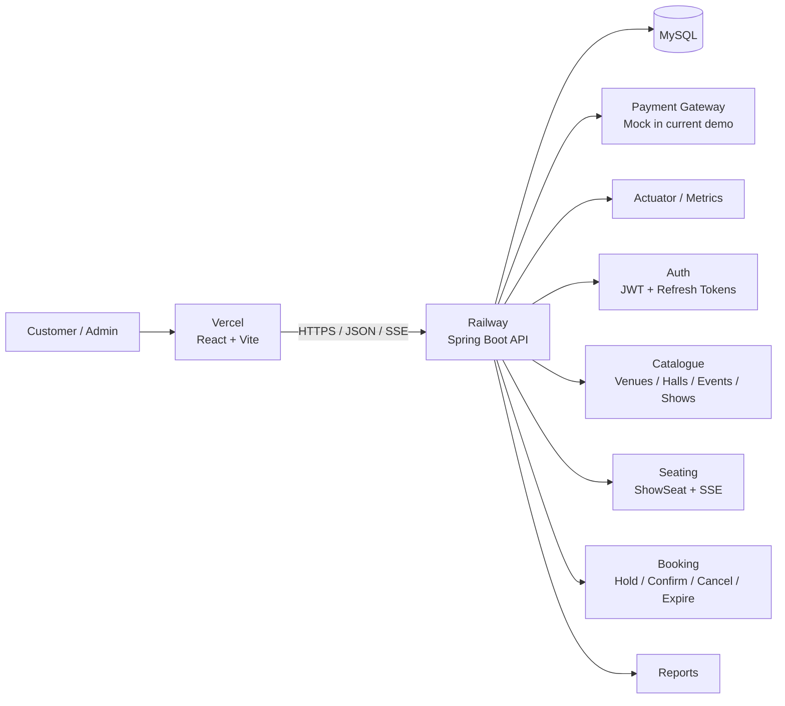

# TicketHub


**TicketHub** is a full-stack ticket-booking platform built around one hard requirement: **seat availability must remain correct even when multiple customers attempt to reserve the same seat at the same time**.

The project combines a Spring Boot backend, MySQL, React/Vite frontend, JWT-based authentication, transactional seat holds, real-time seat updates, booking lifecycle management, and a mock payment gateway. It is designed as a portfolio-grade system that demonstrates practical backend engineering, database consistency, API design, security, testing, and deployment.

---

## Contents

- [What TicketHub solves](#what-tickethub-solves)
- [Product capabilities](#product-capabilities)
- [Architecture](#architecture)
- [Booking lifecycle](#booking-lifecycle)
- [Seat concurrency and consistency](#seat-concurrency-and-consistency)
- [Security model](#security-model)
- [Technology stack](#technology-stack)
- [Repository structure](#repository-structure)
- [API surface](#api-surface)
- [Database and migrations](#database-and-migrations)
- [Local development](#local-development)
- [Configuration](#configuration)
- [Running the test suite](#running-the-test-suite)
- [CI/CD](#cicd)
- [Production deployment](#production-deployment)
- [Demo environment](#demo-environment)
- [Operational constraints](#operational-constraints)
- [Current limitations](#current-limitations)
- [Roadmap](#roadmap)
- [Engineering notes](#engineering-notes)
- [License](#license)

---

## What TicketHub solves

A ticket-booking application is not only a CRUD application. The difficult part is preserving the relationship between:

**seat availability → temporary reservation → payment → confirmation → cancellation/expiry**

TicketHub treats the booking path as a transactional workflow.

The system is designed to guarantee that:

1. A seat can only be held when it is currently available.
2. A partially unavailable multi-seat request does not leave a partial hold behind.
3. Two concurrent requests cannot successfully reserve the same active seat.
4. Expired holds return seats to availability.
5. Payment callbacks are handled idempotently.
6. Cancellation releases seats when policy allows.
7. Database transactions do not remain open while waiting for a payment gateway.
8. Authentication and authorization are enforced server-side rather than only in the UI.

---

## Product capabilities

### Customer experience

- Browse and search events.
- Filter catalogue results by event category.
- Choose a venue, hall, and showtime.
- View the live seat map for a show.
- Select up to six seats per booking.
- See seat category and price information.
- Temporarily hold selected seats.
- Review the booking before payment.
- Complete the demo payment flow.
- Receive a booking confirmation and QR code.
- View authenticated booking information.
- Receive real-time seat-state updates through Server-Sent Events (SSE).

### Authentication and account security

- User registration with server-side validation.
- BCrypt password hashing.
- JWT access tokens.
- Refresh-token rotation.
- Refresh-token replay detection and revocation.
- Logout that revokes the user's refresh tokens.
- Role-based authorization for admin operations.
- Login rate limiting.
- Generic invalid-credential responses to avoid exposing account details.

> **Not implemented yet:** email verification and the Forgot Password / password-reset flow. These are planned authentication-security improvements.

### Administration

Admins can:

- Create and manage venues.
- Create and manage halls.
- Create and manage events.
- Schedule shows.
- Cancel shows.
- Archive events.
- Inspect sales reports.
- Inspect show occupancy.

The frontend hides admin controls for non-admin users, while the backend independently enforces the ADMIN role.

### Payments

The application uses a **mock payment gateway** for the deployed portfolio demo.

The payment layer is intentionally abstracted behind a gateway interface so a production payment provider can be introduced without rewriting the booking domain.

> This repository does **not** process real-money payments in its current demo deployment.

---

## Architecture



### Deployment topology

| Component | Current deployment | Responsibility |
|---|---|---|
| React frontend | Vercel | Static UI, seat-selection client, authenticated customer/admin flows |
| Spring Boot backend | Railway | REST APIs, business logic, authentication, booking transactions, SSE |
| MySQL | Railway | Persistent application state |
| Payment provider | Mock | Demonstration-only payment lifecycle |

### Request flow

```text
Browser
  │
  ├── GET /events
  ├── GET /events/{id}/shows
  ├── GET /shows/{id}/seats
  │
  └── POST /shows/{id}/holds
              │
              ▼
        Spring Security
              │
              ▼
        Booking Service
              │
              ▼
            MySQL
```

---

## Booking lifecycle

A normal customer booking follows this sequence:

```text
Discover event
      ↓
Select show
      ↓
Load seat map
      ↓
Select seats
      ↓
Create temporary seat hold
      ↓
Review booking
      ↓
Start payment
      ↓
Payment callback / confirmation
      ↓
Confirm booking
      ↓
Generate ticket + QR code
```

### Hold state

Seat state is treated as a state machine rather than a UI-only flag:

```text
AVAILABLE
   │
   ├── hold ──► HELD
   │              │
   │              ├── payment + confirmation ──► BOOKED
   │              │
   │              └── expiry / release ────────► AVAILABLE
   │
   └── already unavailable ──► reject request
```

---

## Seat concurrency and consistency

This is the core engineering problem in TicketHub.

### 1. Atomic conditional hold

The primary guard performs a conditional database update that changes requested seats from:

`AVAILABLE → HELD`

only when they are still available.

If the number of rows updated is smaller than the number requested, the transaction fails and the booking attempt does not leave a partial hold.

### 2. Database-level uniqueness

The schema also protects active seat assignments with a unique generated-column strategy.

MySQL does not provide a direct partial unique index, so the active booking seat identifier is populated only for active booking items and left NULL for inactive ones.

This gives the database a second line of defense against duplicate active reservations.

### 3. Optimistic locking

`@Version` optimistic locking is used on booking and show-seat state transitions where lost updates are possible.

### 4. Deadlock handling

The seat-hold path:

- orders seat IDs consistently,
- uses a short lock scope,
- retries selected deadlock losers in a **new transaction**,
- never waits for an external payment gateway while holding database locks.

### 5. Real-time updates

The backend publishes seat-state changes through SSE.

The frontend listens for updates and removes selections that become unavailable.

This improves the user experience while the database remains the final source of truth.

---

## Security model

TicketHub uses a stateless bearer-token authentication model.

### Authentication

- Passwords are stored as BCrypt hashes.
- Access tokens are short-lived.
- Refresh tokens are rotated.
- Refresh tokens are stored as SHA-256 hashes in the database.
- Refresh-token reuse results in revocation of the user's refresh-token family.
- Logout revokes outstanding refresh tokens.

### Authorization

Admin endpoints require the `ADMIN` role.

The rule is enforced at the API layer. Hiding a button in React is not treated as a security control.

### Input validation

Registration and authentication requests are validated on the backend.

Signup password policy currently requires:

- 8–72 characters.
- At least one lowercase character.
- At least one uppercase character.
- At least one digit.
- At least one special character.

### Rate limiting

The current application rate-limits:

- login attempts,
- seat-hold attempts.

### CORS

Allowed browser origins are configured through `CORS_ORIGINS` rather than hard-coded production domains.

---

## Technology stack

### Backend

- Java 21
- Spring Boot 3.3.4
- Spring Web
- Spring Data JPA / Hibernate
- Spring Security
- Spring Validation
- Spring Actuator
- Flyway
- MySQL Connector/J
- JJWT
- Springdoc OpenAPI
- ZXing for QR generation
- Lombok

### Frontend

- React 18
- Vite 5
- Browser Fetch API
- Server-Sent Events for live seat updates

### Testing

- JUnit / Spring Boot Test
- Spring Security Test
- Testcontainers
- MySQL 8 integration environment

### Infrastructure

- GitHub
- GitHub Actions
- Docker
- Railway
- Vercel

---

## Repository structure

```text
tickethub/
├── .github/
│   └── workflows/
│       └── ci.yml
├── frontend/
│   ├── src/
│   │   ├── AdminDashboard.jsx
│   │   ├── App.jsx
│   │   ├── AuthPage.jsx
│   │   ├── SeatMap.jsx
│   │   ├── api.js
│   │   └── styles.css
│   ├── package.json
│   └── package-lock.json
├── src/
│   ├── main/
│   │   ├── java/com/tickethub/
│   │   │   ├── auth/
│   │   │   ├── booking/
│   │   │   ├── catalogue/
│   │   │   ├── common/
│   │   │   ├── config/
│   │   │   ├── payment/
│   │   │   ├── report/
│   │   │   ├── seating/
│   │   │   └── user/
│   │   └── resources/
│   │       ├── db/migration/
│   │       └── application.yml
│   └── test/
│       └── java/com/tickethub/
├── .env.example
├── DEPLOY.md
├── Dockerfile
├── docker-compose.yml
├── pom.xml
└── README.md
```

### Domain boundaries

The backend is organized around business capabilities rather than one large controller/service layer:

- `auth` — authentication, JWT, refresh-token management.
- `catalogue` — venues, halls, seats, events, shows.
- `seating` — per-show seat state and live updates.
- `booking` — holds, payment lifecycle, confirmation, expiry, cancellation.
- `payment` — gateway abstraction, signed webhook handling, idempotency.
- `report` — operational and administrative reporting.
- `user` — account and role data.
- `common` — shared API and error-handling infrastructure.
- `config` — application configuration, security, rate limiting, demo configuration, OpenAPI.

---

## API surface

The complete contract is available through Swagger/OpenAPI.

**Local:** http://localhost:8080/swagger-ui.html

**Production:** https://tickethub-production-3863.up.railway.app/swagger-ui.html

### Authentication

```text
POST /api/v1/auth/register
POST /api/v1/auth/login
POST /api/v1/auth/refresh
POST /api/v1/auth/logout
GET  /api/v1/users/me
```

### Catalogue

```text
GET /api/v1/events
GET /api/v1/events/{eventId}/shows
```

### Seating and booking

```text
GET  /api/v1/shows/{showId}/seats
GET  /api/v1/shows/{showId}/seats/stream
POST /api/v1/shows/{showId}/holds

GET  /api/v1/bookings
GET  /api/v1/bookings/{bookingRef}
POST /api/v1/bookings/{bookingRef}/payments
```

### Payments

```text
POST /api/v1/payments/webhook
```

The demo profile also exposes a development-only payment simulation endpoint:

`POST /api/v1/dev/bookings/{bookingRef}/simulate-payment`

Do not enable the development payment simulation in a real-money environment.

### Admin

```text
GET    /api/v1/admin/venues
GET    /api/v1/admin/venues/{venueId}/halls

POST   /api/v1/admin/venues
POST   /api/v1/admin/venues/{venueId}/halls

POST   /api/v1/admin/events
PUT    /api/v1/admin/events/{eventId}
DELETE /api/v1/admin/events/{eventId}

POST   /api/v1/admin/shows
POST   /api/v1/admin/shows/{showId}/cancel

GET    /api/v1/admin/reports/sales
GET    /api/v1/admin/reports/occupancy
```

---

## Database and migrations

Flyway owns schema evolution.

The application runs with:

```yaml
spring.jpa.hibernate.ddl-auto: validate
```

That means Hibernate validates the schema rather than silently changing it.

Migrations live under:

`src/main/resources/db/migration/`

The database contains the core entities required by the booking domain, including:

- users
- refresh tokens
- venues
- halls
- seats
- events
- shows
- show seats
- bookings
- booking items
- payments

### Why MySQL matters

The booking consistency model relies on MySQL/InnoDB behavior.

The integration suite intentionally uses **real MySQL 8 through Testcontainers** instead of H2 so the tests exercise real transaction, locking, generated-column, and SQL behavior.

---

## Local development

### Prerequisites

Install:

- Java 21
- Maven 3.9+
- Node.js 20+
- Docker
- Git

### 1. Start backend + MySQL

```bash
docker compose up --build
```

Backend:

`http://localhost:8080`

Swagger:

`http://localhost:8080/swagger-ui.html`

### 2. Start the frontend

Open a second terminal:

```bash
cd frontend
npm install
npm run dev
```

Frontend:

`http://localhost:5173`

### 3. Stop services

```bash
docker compose down
```

To remove the local database volume as well:

```bash
docker compose down -v
```

> Removing the volume deletes local MySQL data.

---

## Configuration

Copy the example environment file:

```bash
cp .env.example .env
```

### Backend

| Variable | Purpose |
|---|---|
| `DB_URL` | JDBC connection URL |
| `DB_USER` | Database user |
| `DB_PASSWORD` | Database password |
| `JWT_SECRET` | HS256 signing secret; use a strong random value |
| `PAYMENT_WEBHOOK_SECRET` | HMAC secret for payment-webhook verification |
| `CORS_ORIGINS` | Comma-separated allowed frontend origins |
| `PORT` / `SERVER_PORT` | Optional application port override |
| `SPRING_PROFILES_ACTIVE` | Optional demo profile |

### Frontend

| Variable | Purpose |
|---|---|
| `VITE_API_URL` | Public backend URL without a trailing slash |

Example:

```text
VITE_API_URL=https://tickethub-production-3863.up.railway.app
```

### Production secret handling

Do not commit:

- database credentials,
- JWT secrets,
- payment webhook secrets,
- SMTP credentials,
- provider API keys.

Use Railway/Vercel environment variables or your organization's secret-management solution.

---

## Running the test suite

### Full verification

```bash
mvn clean verify
```

The integration suite starts MySQL 8 using Testcontainers.

Docker must be running.

### What the tests cover

| Suite | Main guarantee |
|---|---|
| `SeatHoldConcurrencyTest` | Concurrent requests cannot double-reserve a seat |
| `BookingLifecycleTest` | Hold → payment → confirmation, expiry, cancellation, refund, and ownership rules |
| `AuthApiTest` | Registration, validation, login, token rotation, and role checks |
| `CatalogueServiceTest` | Seat generation, show overlap rules, search behavior |
| `SeatMapApiTest` | Seat-map reads and unavailable-seat conflict handling |
| `JwtServiceTest` | JWT generation and validation |
| `WebhookSignatureVerifierTest` | Signed webhook validation |
| `BookingReferenceGeneratorTest` | Booking reference generation |

### Testing principle

The project deliberately prefers integration tests against the actual database for concurrency-sensitive behavior.

An in-memory database would hide the behavior this application is most concerned about.

---

## CI/CD

GitHub Actions runs on:

- every pull request,
- every push to `main`.

The pipeline currently contains three stages:

### Backend

```text
Java 21
→ Maven
→ unit tests
→ Testcontainers + MySQL 8 integration tests
```

### Frontend

```text
Node.js 20
→ npm ci
→ Vite production build
```

### Docker

```text
Backend build
→ Docker image build
```

Pull requests should be merged only after CI is green.

---

## Production deployment

The project is designed for a split deployment:

```text
Vercel
  └── React frontend

Railway
  ├── Spring Boot backend
  └── MySQL
```

Deployment instructions are maintained separately in:

**[DEPLOY.md](./DEPLOY.md)**

### Current live demo

**Frontend**

https://tickethub-3rr1.vercel.app

**Backend**

https://tickethub-production-3863.up.railway.app

**Swagger**

https://tickethub-production-3863.up.railway.app/swagger-ui.html

---

## Demo environment

The portfolio deployment can use the `demo` Spring profile.

Seeded demo accounts:

```text
Admin
Email: admin@tickethub.dev
Password: Admin123!

User
Email: user@tickethub.dev
Password: User1234!
```

The demo also uses the mock payment gateway.

> These credentials are intentionally public and must never be reused for a real deployment.

---

## Operational constraints

The current architecture has one important scaling constraint:

### One backend instance

The application currently expects **one backend instance** because:

- SSE seat updates are maintained in memory.
- The login/hold rate limiter is in memory.

Running multiple backend instances can cause:

- clients connected to different instances to miss in-memory SSE events,
- rate limits to apply independently per instance.

The database remains the source of truth for booking correctness.

### Production scaling path

A future distributed deployment should move these pieces to shared infrastructure, for example:

```text
Redis
├── distributed rate limiting
└── pub/sub for seat-update fan-out
```

The booking database transactions can remain the final consistency boundary.

---

## Current limitations

This repository is a strong portfolio implementation, but it is not presented as a finished commercial ticketing platform.

Current limitations include:

- Payment provider is mocked.
- Email verification is not implemented yet.
- Forgot Password / password reset is not implemented yet.
- In-memory SSE fan-out limits horizontal backend scaling.
- In-memory rate limiting limits horizontal backend scaling.
- The current deployment is optimized for demonstration and portfolio evaluation rather than high-volume production traffic.
- Observability is currently centered on Actuator and platform logs rather than a full distributed tracing stack.

These constraints are explicit so the system's current guarantees are not overstated.

---

## Roadmap

### Authentication and account security

- Email ownership verification.
- Resend verification email.
- Forgot Password flow.
- Time-limited single-use password-reset tokens.
- Session invalidation after password reset.
- Production email provider integration.

### Payments

- Replace mock gateway with a real provider.
- Provider-specific webhook validation.
- Retry and reconciliation workflows.
- Payment/refund observability.

### Scalability

- Redis-backed rate limiting.
- Redis/SSE event fan-out.
- Multiple backend replicas.
- Background jobs for operational workflows.

### Platform maturity

- Full observability stack.
- Structured audit logs.
- Stronger automated API contract tests.
- Performance benchmarks and load tests with recorded baselines.
- Production-grade backups and disaster-recovery procedures.

---

## Engineering notes

### Why the booking path is transaction-first

The application treats the database transaction as the authority over seat ownership.

The frontend can become stale.

An SSE event can arrive late.

Two browsers can click the same seat simultaneously.

A payment gateway can retry a webhook.

The booking layer therefore assumes that every external or UI signal can race or repeat and makes the database state transition authoritative.

### Why payment is outside the seat transaction

A remote gateway is not part of the database transaction.

Holding a database lock while waiting for an external HTTP system would increase lock duration and create avoidable contention.

TicketHub instead separates:

```text
seat transaction
      ↓
booking state
      ↓
payment operation
      ↓
signed/idempotent callback
      ↓
final confirmation transaction
```

### Why refresh tokens are rotated

A refresh token is a credential.

Rotating the token on use limits the useful lifetime of a stolen refresh token and gives the server a way to detect replay.

---

## Contributing

Before opening a pull request:

```bash
mvn clean verify
cd frontend
npm ci
npm run build
```

Keep changes focused and include tests for business-critical behavior.

For concurrency-sensitive changes, prefer integration tests against MySQL rather than relying only on mocks.

---

## License

This project is licensed under the **MIT License**.

See the repository license file for the full text.
